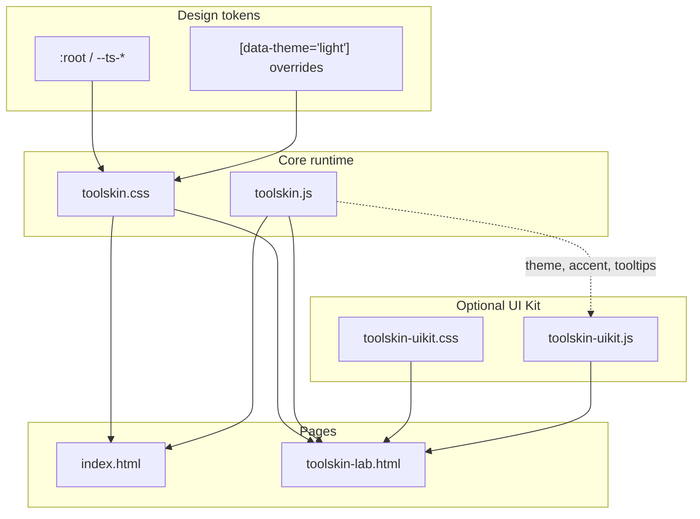

# Toolskin Showcase — Workspace Report (for AI / handoff)

**Project:** `toolskin-showcase` — public demo, documentation surface, and integration lab for the **Toolskin** design system (CSS tokens + vanilla JS) and the optional **Toolskin UI Kit** (`ts-ui-*`).

**Purpose of this document:** Give a complete map of the repository, how files relate, what has been built, and what is in progress—so another session (e.g. Claude) can continue without rediscovering the tree.

---

## 1. Executive summary

| Layer | Role |
|--------|------|
| **`assets/css/toolskin.css`** | Single source of design tokens (`--ts-*`), layout, surfaces, components, utilities, dark default + `[data-theme="light"]` overrides. |
| **`assets/js/toolskin.js`** | `Toolskin` runtime: theme (`ToolskinTheme`), accent (`setAccent` / `setAccentHex`), tabs, modals, toasts, tooltips, smooth scroll (Lenis), observers, cursor, `init()`. |
| **`assets/css/toolskin-uikit.css`** | Optional UI Kit styles: `ts-ui-*` components + aliases (`ts-checkbox` patterns may overlap core—see §6). |
| **`assets/js/toolskin-uikit.js`** | `window.ToolskinUIKit`: accordion, select, table sort/bulk, toast, draggable, resizable, sortable, masonry hooks, Firefox scrollbar env. |
| **`index.html`** | Main marketing/showcase page: hero, components, theme toggle, **accent swatches**, **palette / surface swatch grid** with hex labels (JS), marquee, masonry, etc. |
| **`toolskin-lab.html`** | Focused **UIKit lab**: controls, tables, accordion, masonry demos, API snippets. |
| **`mockup/`** | Static HTML prototypes (YSS toolpanel, modals, etc.) — reference for layouts, not the canonical framework entry. |
| **`generator/`** | Banner/pattern generator mini-apps. |
| **`docs/`** | Human docs (`README.md`, `QUICK_REFERENCE.md`, `TOOLSKIN_USAGE_GUIDE.md`, integration notes). |

---

## 2. Directory tree (concise)

```
toolskin-showcase/
├── index.html                 # Main showcase + inline theme/swatch UX
├── toolskin-lab.html          # UI Kit component lab
├── assets/
│   ├── css/
│   │   ├── toolskin.css       # Core design system (~8.5k lines)
│   │   ├── toolskin-uikit.css # UI Kit companion
│   │   ├── extra-styles.css   # Add-on / page-specific
│   │   ├── ts-patterns.css    # Pattern library
│   │   └── *.user.css         # Archived userscript styles (reference)
│   └── js/
│       ├── toolskin.js        # Core framework JS
│       ├── toolskin-uikit.js  # UI Kit JS
│       ├── ts-gradient-canvas.js
│       ├── three-js-grads.js
│       └── userscripts/       # Large userscript ports (YouTube panel, etc.)
├── mockup/                    # HTML mockups (toolpanels, modals)
├── generator/                 # Banner / pattern tools + presets
├── docs/                      # Markdown documentation
└── _bu/                       # Backups (older HTML/CSS)
```

---

## 3. Architecture wireframe (conceptual)



**Load order (typical):**

1. `toolskin.css`
2. `toolskin-uikit.css` (if using UI Kit)
3. `toolskin.js` (`defer`)
4. `toolskin-uikit.js` (`defer`)

---

## 4. `toolskin.css` — structure (TOC-aligned)

The file header lists sections **§1–§10**. High-value areas:

| Section | Contents |
|---------|-----------|
| **§1 Design tokens** | Accent HSL engine (`--ts-accent-h/s/l`), surfaces `--ts-bg-0…`, text, borders, spacing, radius, shadows, motion. |
| **§4 Layout** | `.ts-container`, `.ts-section`, `.ts-grid`, `.ts-flex-*`, **`.ts-masonry`** (CSS grid + spans + `grid-auto-flow: dense`). |
| **§6 Components** | Buttons, cards, panels, forms, toggles, sliders, tabs, badges, nav, modal, tables, toast, tooltips, flip cards, pricing, **color swatch** primitives. |
| **§8 Effects** | Grain, scroll animations, scrollbar tokens (`--ts-sb-*`). |
| **Light mode** | Block near **~line 6912+**: `[data-theme="light"]` token overrides (borders, shadows, accent readability on white, status colors). |

**Checkbox / radio (recent integration — your work)**  
**Approx. lines 2851–3080** in `toolskin.css`:

- **`.ts-checkbox-row`** — flex row; native-looking row + later **block** styling with `--size`, padding, borders, hover (two blocks in file: simple row + enhanced row).
- **`.ts-field-group`**, **`.ts-table--bulk`** — sizing vars (`--ts-checkbox-size`, `--ts-checkbox-mark-inset`).
- **`.ts-checkbox` / `.ts-radio`** — wrappers; size modifiers **`--md`, `--lg`, `--xl`** (no `sm`).
- **Selectors** tie together: `.ts-control--checkbox`, `.ts-control--radio`, `.ts-checkbox-row`, `.ts-checkbox`, `.ts-radio`, `.ts-table--bulk` for consistent custom appearance (`appearance: none`, gradients, `::before` checkmark/dot).
- Uses **`--ts-accent-border`**, **`var(--ts-accent-glow-bg-*)`**, **`color-mix`**, focus rings.

**Note:** `toolskin-uikit.css` historically used `--ts-ui-control-size` names; **core `toolskin.css` now uses `--ts-checkbox-*`** for the integrated checkbox system. If both sheets load, watch for duplicate/conflicting rules on the same selectors.

---

## 5. `toolskin.js` — modules (header list)

From the file banner:

- **ToolskinTabs** — `.ts-tab` / `.ts-tab-pane`
- **ToolskinModal** — modals + backdrop
- **ToolskinToast** — toasts
- **ToolskinToggle** — collapse panels
- **ToolskinObserver** — scroll / intersection animations
- **ToolskinIcons** — `data-icon` injection
- **ToolskinTheme** — dark/light + persistence (`storageKey: ts-theme-mode`)
- **ToolskinSmooth** — Lenis
- **ToolskinLocomotive** — optional parallax
- **ToolskinConfig** — merged config
- **ToolskinTooltip** — `[data-tooltip]` / `initTooltips`
- **`Toolskin.init()`** — wires everything

**Accent API (typical):**

- `Toolskin.setAccent(h, s, l)`
- `Toolskin.setAccentHex('#rrggbb')` — used by **theme swatches** on `index.html`

---

## 6. UI Kit (`toolskin-uikit.*`)

**CSS:** `ts-ui-*` components: accordion (aliases `ts-accordion`), select, table sort/bulk, toast, draggable/resizable/sortable, scrollbars, masonry helpers (`ts-ui-masonry--grid`, `--lanes`, `--v2`), form groups, etc.

**JS:** `ToolskinUIKit.init(document)` — accordions, selects, spinners, drag/resize/sort, table sort/bulk, masonry v2 observer, number inputs.

**Interop:** Adds `html.ts-env-moz` on Firefox so `.ts-ui-scrollbar--moz` does not break WebKit scrollbars on Chromium.

---

## 7. `index.html` — role + recent additions

**Role:** Full **Toolskin** marketing + component gallery: navigation, hero, pricing, flip cards, masonry, marquee, panels, theme toggle.

**Theme swatches & palette UI (approx. lines 78–190 inline `<style>`):**

- **`.theme-swatches`** — flex row of **`.theme-swatch`** presets calling `Toolskin.setAccentHex(...)` on click.
- **Grid layout for palette cards (scoped to `#tokens` only):** `div:has(>.ts-flex-col .ts-swatch)` + **`.ts-flex-col:has(.ts-swatch)`** — CSS grid placing **`.ts-swatch`** preview next to **`.swatch-hex-label`** + **`.ts-caption`** (hex + label rows). **`.ts-swatch--picker`** is excluded so the **Forms** color control does not pick up token-grid rules.
- **`#token-lab-dynamic-grid`** — live readout of computed `--ts-*` values (refreshes on theme change).
- **`#token-preview-root`** — isolated preview using **`--token-preview-accent`** / **`--token-preview-surface`** / **`--token-preview-muted`**; accent presets and gradient **`.ts-grad-swatch`** buttons update preview only; **Apply** calls `Toolskin.setAccentHex` once; **Reset** copies current theme tokens back into the preview.

**Bottom-of-file script (tokens + forms):**

- **`getHexFromElement(el)`** — reads computed `backgroundColor`, converts to `#RRGGBB`.
- **`updateSwatchLabels(selector)`** — injects/updates **`.swatch-hex-label`** after each matching `.ts-swatch` (avoids duplicate spans).
- **`initThemeObserver()`** — `MutationObserver` on `<html>` for `data-ts-theme` / `class` changes to refresh hex labels **and** the token lab grid.
- **`initFormsColorSwatch()`** — syncs `#forms .ts-swatch--picker` color input, **`.ts-swatch__preview`**, and hex text (no `nextElementSibling`).

**Also on page:** “Live accent swatches” (`onclick="Toolskin.setAccentHex(...)"`), `ts-theme-toggle` button.

**Future / related:** `generator/banner-generator.html` (and siblings under `generator/`) is a **standalone** mini-app with its own token naming (`--ui-*`). A later phase may map that layout to `--ts-*` for a shared editor; core showcase work stays in `index.html` + `assets/css/toolskin.css` §6t (`.ts-swatch`, **`.ts-swatch--picker`**, `.ts-grad-swatch`).

---

## 8. `toolskin-lab.html`

Vanilla **UIKit** playground: toast, accordion, select, spinner, tooltips, drag/resize, sortable, **checkbox/radio** demos (may reference patterns aligned with uikit + core), data table, **masonry** section (core `.ts-masonry`, UI Kit grids, lanes + photo tiles).

---

## 9. Supporting assets

| File | Notes |
|------|--------|
| `assets/css/extra-styles.css` | Extra showcase styling. |
| `assets/css/ts-patterns.css` | Reusable pattern blocks. |
| `assets/js/ts-gradient-canvas.js` | Canvas gradient utilities. |
| `mockup/*.html` | Product UI mocks — good for **layout/copy** reference. |
| `generator/` | Standalone tools; not required for core framework. |

---

## 10. Documentation already in repo

- `docs/README.md` — design system overview, tokens, `Toolskin.*` API samples.
- `docs/QUICK_REFERENCE.md` — quick class/API reference.
- `docs/TOOLSKIN_USAGE_GUIDE.md` — usage guide.
- `docs/banner-generator-parameter-mapping.md` — generator specifics.
- `PATTERNS_INTEGRATION_REPORT.md` — patterns integration notes.

---

## 11. Recent progress checklist (chronological themes)

1. **Core design system** — HSL accent engine, `color-mix` derivatives, layout/masonry, light theme block.
2. **UIKit alignment** — `ts-ui-*` + optional `ts-*` aliases; accordion, tables, scrollbars; lab refactors.
3. **Checkbox/radio moved into `toolskin.css`** (lines ~2851–3080) — unified custom controls, row variants, sizes md/lg/xl, table bulk, focus rings.
4. **Index showcase** — theme swatches + palette grid + **auto hex labels** + observer for theme changes.
5. **Masonry** — `.ts-masonry` uses **dense** packing; UI Kit lanes fallback uses flex + **photo** tiles + `object-fit: cover` where `grid-lanes` is unsupported.

---

## 12. Open work — color palette (frontend, dark, **especially light**)

**Stated goal:** Improve palette quality on the frontend, in **dark** and **light** themes.

**Where to work:**

1. **`:root` in `toolskin.css`** — default (dark-leaning) backgrounds `--ts-bg-*`, text `--ts-text-*`, borders, semantic `--ts-success|warning|danger|info`.
2. **`[data-theme="light"]` (~6920+)** — already adjusts borders, shadows, accent mixes for white backgrounds, status hues; **candidate for refinement** if light still feels washed or low-contrast.
3. **`ToolskinTheme` / `data-ts-theme` / `data-theme`** — ensure JS and CSS attribute names stay in sync when adding new token sets.
4. **Index swatch section** — visual QA when tokens change; hex labels will update from computed styles.

**Suggestions for next implementation pass:**

- Audit **WCAG contrast** for `--ts-text-primary` / `--ts-text-secondary` on `--ts-bg-0`–`--ts-bg-2` in both themes.
- Consider **semantic palette tokens** (e.g. `--ts-palette-surface-elevated`) instead of one-off rgba in light block.
- Add **reduced-motion** and **print** if product requires it (optional).

---

## 13. Quick reference — key files by task

| Task | Files |
|------|--------|
| Change global colors | `toolskin.css` `:root` + `[data-theme="light"]` |
| Change accent at runtime | `toolskin.js` (`Toolskin.setAccent*`), `index.html` swatches |
| Checkbox/radio look | `toolskin.css` ~2851–3080 |
| Swatch hex labels | `index.html` styles ~112–207, script ~2829+ |
| New UI Kit component | `toolskin-uikit.css` + `toolskin-uikit.js`, demo in `toolskin-lab.html` |
| Masonry layout | `toolskin.css` `.ts-masonry`; UI Kit `toolskin-uikit.css` `ts-ui-masonry--*` |

---

## 14. Treemap (ownership)

```
toolskin-showcase
├── Showcase & marketing .............. index.html
├── UI Kit experiments ................ toolskin-lab.html
├── Canonical styles .................. assets/css/toolskin.css
├── Canonical behavior ................ assets/js/toolskin.js
├── Optional UI Kit ................... assets/css/toolskin-uikit.css
│                                      assets/js/toolskin-uikit.js
├── Reference / product mockups ......... mockup/
├── Tools ............................. generator/
└── Human docs ........................ docs/ (+ this file)
```

---

*Generated for AI continuity. Update this file when major structure or ownership changes.*
