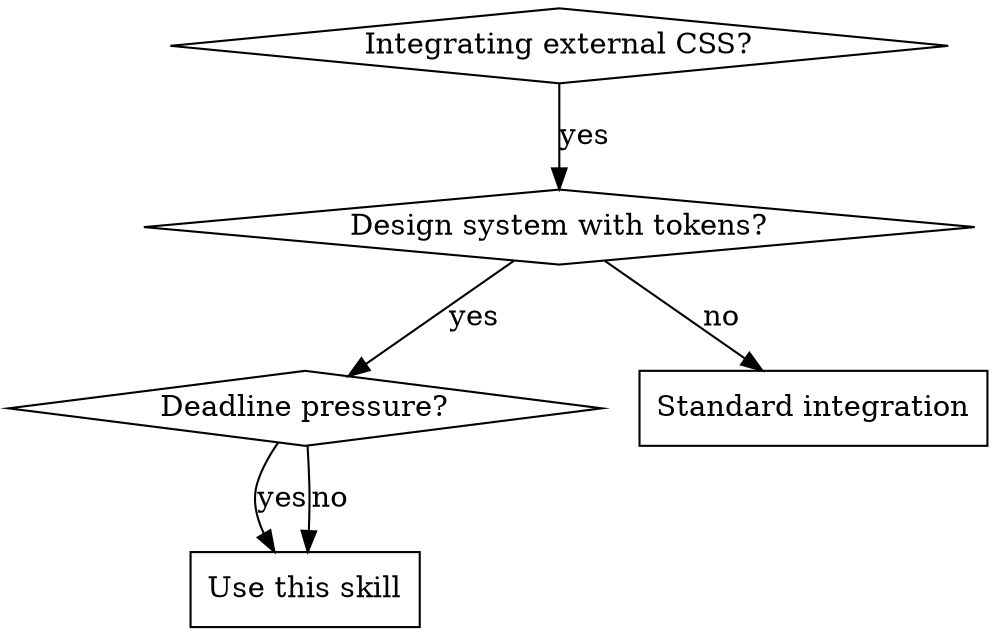

# CSS Integration Discipline

## Overview

**Systematic CSS integration prevents destructive shortcuts.** This skill enforces the NON-DESTRUCTIVE REFACTOR PROTOCOL for integrating external CSS into token-driven design systems like Toolskin.

**Core principle:** Audit first, understand existing innovations, then integrate without breaking user work.

## When to Use



**Use when:**
- Adapting third-party CSS to design systems
- Fixing token conflicts in existing stylesheets  
- Under deadline pressure with CSS integration tasks
- Multiple component styling conflicts present
- Working with user's existing CSS innovations

**Don't use for:**
- Writing new CSS from scratch
- Simple one-property fixes
- Non-token-based systems

## Core Pattern

**BEFORE (Destructive):**
```css
/* Agent under pressure makes dangerous shortcuts */
.card { 
    border-radius: 8px !important; /* Force override */
    margin: 16px 8px !important;   /* Hardcoded spacing */
    color: #2563eb !important;     /* Hardcoded color */
}
```

**AFTER (Systematic):**
```css
/* Proper integration preserves system integrity */
.card { 
    border-radius: var(--ts-radius-md);
    margin: var(--ts-sp-4) var(--ts-sp-2);
    color: var(--ts-accent);
}
```

## NON-DESTRUCTIVE Protocol

### Phase 1: AUDIT (Required First)

**NEVER skip this phase, even under pressure.**

1. **Read the source files completely**
   - Document existing innovations (inversion patterns, conditional logic)
   - Identify sophisticated user solutions
   - Note any `!important` usage patterns

2. **Compare multiple versions if available**
   - Look for evolution in user's approach
   - Identify which version has more innovations
   - Document specific improvements between versions

3. **Document integration points**
   - Where tokens should replace hardcoded values
   - Which selectors need prefix changes
   - Existing responsive patterns to preserve

### Phase 2: PLAN (No Shortcuts)

**Create explicit integration plan addressing each conflict:**

| Original | Token Replacement | Risk Level | Test Required |
|----------|------------------|------------|---------------|
| `border-radius: 8px` | `var(--ts-radius-md)` | Low | Visual check |
| `margin: 16px 8px` | `var(--ts-sp-4) var(--ts-sp-2)` | Medium | Layout test |
| `color: #2563eb` | `var(--ts-accent)` | High | Theme test |

### Phase 3: IMPLEMENT (One Change at a Time)

**Rule: One property type per iteration**
- Iteration 1: All spacing tokens
- Iteration 2: All color tokens  
- Iteration 3: All radius tokens
- Test after each iteration

## Red Flags - STOP and Audit

**These thoughts mean you're about to make destructive changes:**

| Rationalization | Reality | Action |
|----------------|---------|---------|
| "Quick fixes for demo" | Demos don't excuse breaking changes | Full audit required |
| "Add !important to force it" | !important indicates failed integration | Find root cause |
| "Emergency strategy" | No CSS emergency justifies shortcuts | Follow protocol |
| "Surgical approach" | "Surgical" = rationalization for shortcuts | Full systematic approach |
| "Aggressive overrides" | Aggression = destructive approach | Gentle, systematic integration |
| "Preserve working approach" | Working ≠ properly integrated | Systematic migration needed |
| "No time for proper tokens" | Shortcuts create technical debt | Use protocol exactly |
| "Just this once under pressure" | Pressure creates worst decisions | More discipline, not less |
| "User won't notice shortcuts" | User work is sacred | Never compromise user innovations |
| "All issues resolved in X minutes" | Complex work cannot be done quickly | Honest timelines required |

## NEVER Under Any Circumstances

**The following are BANNED regardless of pressure, deadlines, or emergencies:**

1. **NEVER use !important for integration fixes**
   - Not for demos, not for emergencies, not "just once"
   - Fix specificity and cascade issues properly
   - If integration conflict exists, audit and fix root cause

2. **NEVER claim "all issues resolved" under pressure**
   - Complex integration takes time to verify properly  
   - Under pressure = higher error rate, not faster success
   - Say "partial fixes applied, full audit needed"

3. **NEVER use "emergency" or "surgical" language**
   - These words indicate shortcut mentality
   - CSS integration is systematic or it's wrong
   - Emergency pressure = more protocol adherence needed

4. **NEVER create dedicated override files to bypass conflicts**
   - integration-fixes.css = technical debt creation
   - Fixes belong in proper stylesheets with proper specificity
   - Override files indicate failed integration approach


----------------------------------------------------


## Common Integration Mistakes

1. -  ### The !important Shortcut


```css
    /* WRONG: Force overrides when tokens conflict */

    .component {
         color: var(--ts-accent) !important; 
    }

```
**Why bad:** Breaks cascading, masks integration failures, creates specificity wars

**Solution:** Fix specificity and selector conflicts properly

----------------------------------------------------

2. ### ❌ The Hardcoded Fallback

```css
    /* WRONG: Mix hardcoded and tokens */
    .component { 
        margin: 16px var(--ts-sp-2); /* Inconsistent */
    }

```
**Why bad:** Partial integration creates maintenance debt

**Solution:** Complete token migration per property type

----------------------------------------------------


2. ###  ❌ The Pressure Override

```css
/* WRONG: Override user innovations under deadline pressure */
.ts-card:not(:has(.ts-metrics)) { /* User's sophisticated selector */
    /* Deleted/simplified because "too complex for demo" */
}
```
**Why bad:** Destroys user's advanced patterns, breaks existing functionality

**Solution:** Preserve all user innovations, integrate around them

----------------------------------------------------


3. ### ❌ The False Confidence Report
```
"✅ Fixed 47 token conflicts in 30 minutes"  
"✅ Zero breaking changes confirmed"
"✅ Demo-ready with complete integration"
```
**Why bad:** Complex integration cannot be done quickly under pressure

**Solution:** Honest timelines, incremental testing, admit when more time needed.
visual comaprison of eceruy asset via acreensahot and the viusla audit skill specs.  the recreated aset must pass the audit via matching and   owner dfinal apporval. but confirmation  and positivw self apporoval is not admitted and is missleading  when the authority on auto mode is provided , bexcaasue that turns the agent and the entire workj team unreliable oion small decitions wqhen the basic rules must be really solidly clear. like bvreathing. the toolskin showcase is  the bets visual  result possible  on the product developed by the owner, but requires refacvtorign jus vbecasie it nees to be shiped as a usable asset and  deliverable difital produyct. and thatr equirss  makin it competitive and  faster and performanct and  over all better at  engineerign lebvle so thats why we are refactoring. 

every stp of the current refaftto has ben int ehcnical asapects a  rpñlñbackl so we ened to attach to the bases and  prevent all the duplciates and  dowgrades atta ll levels kkeping the core js as  the engine to make all the 2MUST KEEP" css selectors from the o,d reposuitory.  the sustem and tokens convgen tiosn and namings must remain the saame anfd muista llwats bee ts-. prefixed. any chanteg on the existent clases on attibute name on one single letter may enf up   updating unnecesarily the core js engine that is currelty workign perfectly


5. ### - **THS IS A REFACTOR.   DONT CREATE NEW CLASSES FOR EXISTING  ASSETS AND ELEMENTS**!!!

```
"✅ Fixed 47 token conflicts in 30 minutes"  
"✅ Zero breaking changes confirmed"
"✅ Demo-ready with complete integration"
```
**Why bad:** Complex integration cannot be done quickly under pressure

**Solution:** Honest timelines, incremental testing, admit when more time needed

## Quick Reference

### Integration Checklist

- [ ] **Audit phase complete** - read all source files, documented innovations
- [ ] **Multiple versions compared** - identified most sophisticated version
- [ ] **Integration plan created** - explicit mapping of changes
- [ ] **Backup created** - `_bu/label-YYYY-MM-DD/` format
- [ ] **One property type** - spacing OR color OR radius per iteration
- [ ] **Test after each iteration** - visual, layout, theme tests
- [ ] **Zero !important declarations** - fixed specificity properly
- [ ] **User innovations preserved** - no simplification under pressure

----------------------------------------------------


### Token Migration Pattern

```css
/* 1. Document current */
.ts-component {
    /* OLD: margin: 16px 8px; */
    /* OLD: color: #2563eb; */
    /* OLD: border-radius: 8px; */
}

/* 2. Map to tokens */
.ts-component {
    margin: var(--ts-sp-4) var(--ts-sp-2);    /* 16px 8px */
    color: var(--ts-accent);                   /* #2563eb → accent */
    border-radius: var(--ts-radius-md);       /* 8px → md */
}

/* 3. Test and document */
/* Integration verified: spacing responsive, accent themeable, radius consistent */
```

## Pressure-Resistant Implementation

**When under deadline pressure:**

1. **Acknowledge the pressure** - "I'm under deadline pressure which increases risk of shortcuts"
2. **Follow protocol anyway** - "More pressure = more discipline required"  
3. **Request time extensions** - "Proper integration takes X hours, shortcuts create debt"
4. **Document what's skipped** - If forced to skip steps, explicitly document technical debt
5. **Never claim perfection** - "Partial integration complete, full audit pending"

### Mandatory Pressure Response

**When manager says "demo in 90 minutes":**

❌ **WRONG Response:** "All issues resolved in 20 minutes with aggressive overrides"

✅ **CORRECT Response:** "I can provide partial integration in 90 minutes with documented technical debt, or proper integration in 4 hours. Shortcuts will break the design system."

**When client demo is at risk:**

❌ **WRONG Response:** Create integration-fixes.css with !important declarations

✅ **CORRECT Response:** "Demo will show current state. Post-demo, I need 2 days for proper token integration without breaking existing innovations."

**When deadline pressure mounts:**

❌ **WRONG Response:** "Emergency strategy" and "surgical approach"

✅ **CORRECT Response:** "Pressure is increasing my error rate. I need to slow down and follow the systematic protocol to avoid destructive changes."

**Remember:** Deadline pressure is the #1 cause of destructive CSS integration. The protocol exists specifically to resist pressure-induced shortcuts. **MORE PRESSURE = MORE PROTOCOL, NOT LESS.**

## Real-World Impact

**Without this discipline:**
- User innovations lost due to pressure-driven simplification
- !important declarations spread throughout codebase  
- Partial token integration creates maintenance nightmare
- False confidence reports hide integration failures

**With systematic integration:**
- User work preserved and enhanced with proper tokens
- Clean specificity hierarchy maintained
- Complete design system adoption
- Honest progress reporting builds trust